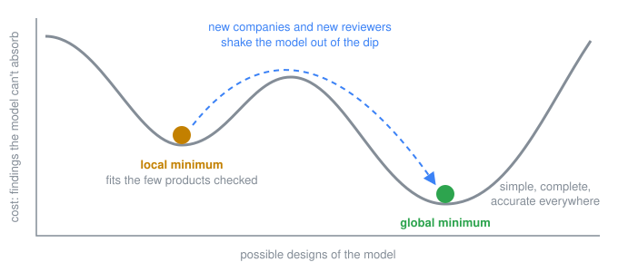
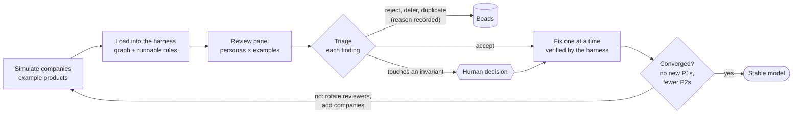

# intent-spec

A unified data model for describing a product across product management, engineering, security, and governance, risk and compliance. It defines the entities, the relationships between them, and the rules those entities and relationships must obey. It starts from established models instead of inventing new ones: Jobs to be Done for product intent, C4 for architecture, DFD3 and STRIDE for threat modeling, and HCGF for governance.

**Status:** a public scratchpad. The model is being worked out in the open, and parts of it are wrong. That's the point: being ambitious and finding out where it's wrong beats thinking small and never learning anything.

## Goal

The model should be:

- **Simple:** the fewest entities, links and rules that can still express real products.
- **Complete:** able to express what many kinds of companies, in different domains and at different stages, need to say about their products.
- **Accurate:** faithful to the established models it builds on. We depart from one only when the evidence shows that a new approach is worth the cost of leaving a standard people already know (INV-9).
- **Composable:** governance is defined once and adopted by many products, and one product's intent can be implemented across many repos.
- **Agent-friendly:** easy for agents to read, query and edit, with stable IDs and rules that say what's wrong and how to fix it.

The model is the deliverable. How it is stored, whether as YAML files, SQL tables or a graph database, is not.

## How we get there

We treat the design as a search for the best model, not the first one that works. A model that fits the few products checked so far can sit in a local minimum: every finding against it looks fixed, but only because nothing has pushed on it from a new direction. New companies and new reviewers supply that push, so every change has to hold up against many products from many points of view.

The process works like simulated annealing. Each round disturbs the model with new examples and rotated reviewers, then lets it settle through fixes.

1. **Simulate companies.** Example products span domains and lifecycle stages: a concept, an MVP, growth-stage and mature products, and a regulated one ([review/examples](review/examples)).
2. **Load them into a test harness.** A Neo4j database holds each example as a graph, and every rule runs as a query against it. Each rule also has an invalid example that breaks it, as a regression test ([harness](harness)). The harness and the YAML examples are test fixtures, not a product.
3. **Review from many perspectives.** A panel of reviewer personas, including product, end user, architecture, threat modeling, GRC, an agent user and a simplicity advocate, reports where the model can't express something, forces the wrong shape, or carries more than it needs ([review/personas](review/personas)).
4. **Fix and repeat.** Findings are triaged, fixed and re-checked ([review/loop.md](review/loop.md)). A human decides anything that touches an invariant. We stop when a round finds no new P1s and fewer P2s than the round before.

## Repository

- [erd.md](erd.md): the model, which holds its entities, links and rules.
- [review](review): example companies, reviewer personas and the review loop.
- [harness](harness): the Neo4j test harness and the rules written as Cypher.
- [journal.md](journal.md): how the model was built, and why it changed.

## Invariants

These hold for every version of the model. Creating, changing or deleting an invariant needs a human decision, and so does any change that contradicts one. Cite them by ID. IDs are never reused, so a removed invariant leaves a gap.

- **INV-1. Intent always wins.** The model describes intent only. It holds no observed or runtime state, and correcting drift or compiling intent into a deployed product is out of scope.
- **INV-5. Intent has lifecycle stages**, for example proposed, ratified and deprecated. Stages are intent, not observed state. A deprecated item stays in place and points to its replacement, or gives a rationale when nothing replaces it.
- **INV-6. Coverage applies to what a scope selects:** every selected item has exactly one disposition. Importing something never creates an obligation.
- **INV-7. References and imports work the same way in every layer.** A reference targets a local item, an imported item, or an external reference (free-text title, optional URL and party) for things that will never publish intent-spec, such as a provider's SOC 2 report or a law. Each link in the ERD declares whether it accepts an external reference (job cites, outcome cites, adoption inherits, influencer cites, influencer binds, secure baseline derives); every other link must resolve to a local or imported item. Where allowed, an external reference satisfies the link's cardinality, but rules that inspect the target skip it.
- **INV-8. The model has no abstract placeholder entities.** Links go to concrete entities. Each link is labelled with a single action verb and points from the dependent item to its anchor.
- **INV-9. Established models stay intact.** C4 follows c4model.com, DFDs follow DFD3, governance follows HCGF and product intent follows JTBD. Their core elements and relationships stay as the source model defines them. Removing, merging or replacing one, or making a stored link derived, needs a very strong reason and a human decision; simplicity (INV-10) alone is never enough. DFD elements stay separate from C4 elements and may optionally represent them.
- **INV-10. Keep it simple.** Every addition is justified by an example that needs it.

## Open

- How the model specifies anything that is derived, not stored.
- The risk model: cause and consequence, treatments, scoring (for example CVSS).
- Which way dependencies run between the product-intent repo and the repos that implement it.
- Business process layer.
