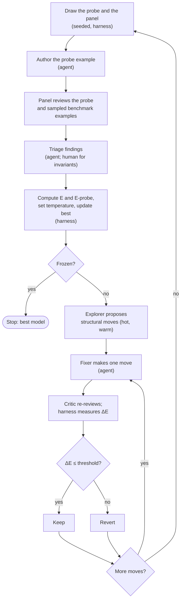

# intent-spec

A unified data model for describing a product across product management, engineering, security, and governance, risk and compliance. It defines the entities, the relationships between them, and the rules those entities and relationships must obey. It starts from established models instead of inventing new ones: Jobs to be Done for product intent, C4 for architecture, DFD3 and STRIDE for threat modeling, and HCGF for governance.

**Status:** a public scratchpad. The model is being worked out in the open, and parts of it are wrong. That's the point: being ambitious and finding out where it's wrong beats thinking small and never learning anything.

## Goal

The model should be:

- **Simple:** the fewest entities, links and rules that can still express real products.
- **Complete:** able to express what many kinds of companies, in different domains and at different stages, need to say about their products.
- **Accurate:** faithful to the established models it builds on. They anchor questions of principle (INV-9), and we depart from one only when the evidence shows that unification is worth the cost of leaving a standard people already know (INV-10).
- **Composable:** governance is defined once and adopted by many products, and one product's intent can be implemented across many repos.
- **Agent-friendly:** easy for agents to read, query and edit, with stable IDs and rules that say what's wrong and how to fix it.

The model is the deliverable. How it is stored, whether as YAML files, SQL tables or a graph database, is not.

## How we get there

We treat the design as a search for the best model, not the first one that works. A model that fits the few products checked so far can sit in a local minimum: every finding against it looks fixed, but only because nothing has pushed on it from a new direction. A search that only ever moves downhill stops in the first dip it finds.


The search is **simulated annealing**. It keeps one current model and changes it one move at a time. Early on it is "hot" and accepts some moves that make things worse, so it can climb out of shallow dips. As it cools it accepts fewer, until it takes only improvements and freezes. We use annealing rather than a genetic algorithm because a candidate model is expensive to evaluate (examples to rewrite, a panel to review), there is one model rather than a population, and we want a single unified model, not several good ones.

The process is being rebuilt around this design. A harness (`anneal/`) makes every mechanical step deterministic, and agents do only the steps that need judgment.

### The parts

**State.** One current model: [erd.md](erd.md) and its rules. A copy of the best model found so far is kept next to it, together with the examples that match it, so the search can always return to it.

**Energy.** One number for how far the model is from where it should be, computed the same way every round:

```
E = 10·P1 + 3·P2 + 1·P3       open accepted findings against the model
  + 10·errors                 harness errors on the benchmark
  + 0.5·size                  entities + links + rules
  + 50·departures             places the model leaves JTBD, C4, DFD3 or HCGF
```

Departures are weighted far above a P1, so leaving an established model pays off only when it resolves several P1s' worth of findings (INV-9, INV-10). Each departure is declared in the ERD, so the count is mechanical.

**Benchmark and probe.** Energy is measured on the **benchmark**, the examples the model has already been fitted to. Each round also adds one **probe**: a software product the fixers have never seen. Its energy is reported separately, because it shows whether the model generalizes or has only been fitted to what it has seen. After its round the probe joins the benchmark. Probes come from a pinned snapshot of [awesome-selfhosted-data](https://github.com/awesome-selfhosted/awesome-selfhosted-data): 1,353 open-source products across 95 tags such as CRM, health, money, e-commerce, IoT and generative AI ([anneal/products-2026-10-08.json](anneal), CC BY-SA 3.0). Open source matters, because the author of a probe models it from the product's own public docs, code and security pages. A mechanical rule decides eligibility: not archived, at least 1,000 stars, updated in the past year. That leaves 729 products in 82 tags. Each draw picks a tag first and then a product within it, from a seeded shuffle without replacement, so probes spread across domains rather than following popularity, and the order can be replayed.

**Panel.** Each round, a fixed core of generalist reviewers always reviews: product management, architecture, threat modeling, governance, the agent user and the simplicity advocate. A seeded sample of the specialists joins them. Every reviewer reviews the probe plus a sample of benchmark examples.

**Moves.** Every change is a move with a size: local (wording, an attribute, a rule), additive (a new attribute, link or rule), structural (adding, removing, merging or splitting an entity, retargeting a link) or unifying (merging concepts across disciplines, INV-12). Most moves fix accepted findings. While the search is hot or warm, an explorer also proposes structural moves nobody asked for, such as removing an entity to see whether the examples can still say everything. These are the random perturbations of annealing, aimed instead of random.

**Acceptance.** We use **threshold accepting**, a deterministic form of annealing: a move is kept when its change in energy (ΔE) is at or below the current threshold. After a fixer commits a move, the harness measures the mechanical part of ΔE (size, departures, errors). A critic re-reviews the affected examples as the persona who raised the finding and files anything new it finds. ΔE is the weight of the findings the move resolves, subtracted from the weight of new findings and the mechanical changes. The harness then keeps the move or reverts it.

| Temperature | Threshold | Moves allowed |
|---|---|---|
| Hot | ΔE ≤ +10 | any size; explorer active |
| Warm | ΔE ≤ +3 | up to structural; explorer active |
| Cool | ΔE ≤ 0 | local and additive |
| Frozen | ΔE < 0 | local only |

A move kept while ΔE > 0 is an **uphill** move. If benchmark energy hasn't fallen by the next round, it is reverted.

**Schedule.** The search starts hot and cools one step per round. It reheats one step when the probe's energy is high, because the model failed to generalize. If energy rises for two rounds in a row, the current model is compared with the best copy and may be reset to it. The search stops when it is frozen, benchmark energy has stopped falling, and the probe's energy is close to the benchmark's.

### One round



### What is stored

| What | Where | Why |
|---|---|---|
| The current model and examples | `erd.md`, `harness/rules`, `review/examples` | the state being annealed |
| The best model so far | `anneal/best/` (model, rules and matching examples) | to compare or reset without git archaeology |
| Round, temperature, seed, probe cursor, energy history | `anneal/state.json` | so every mechanical step can be replayed |
| The company snapshot and eligibility | `anneal/companies-*.json` | the source of probes |
| Findings, moves and decisions | beads | the reasoning behind each move |

Everything else is derived. All of it lives in git, so the orchestrating agent keeps nothing in memory and can stop and resume at any point.

**What is deterministic and what isn't.** The harness does the draws, the panel sample, energy, the threshold decision, the schedule, the best copy and the stop check. Agents do what needs judgment: writing examples, reviewing, triage, proposing moves, making fixes and the critic's re-review. A human decides anything that touches an invariant or departs from an established model.

## Repository

- [erd.md](erd.md): the model, which holds its entities, links and rules.
- [review](review): example companies, reviewer personas and the review loop.
- [harness](harness): the Neo4j test harness and the rules written as Cypher.
- [anneal](anneal): the annealing state, the best model so far and the company snapshot.
- [journal.md](journal.md): how the model was built, and why it changed.

## Invariants

These hold for every version of the model. Creating, changing or deleting an invariant needs a human decision, and so does any change that contradicts one. Cite them by ID. IDs are never reused, so a removed invariant leaves a gap.

- **INV-1. Intent only.** The model describes what a product is meant to be, never what is observed at runtime. Detecting drift between intent and reality, and compiling intent into a running product, are out of scope.
- **INV-7. One way to refer to anything.** An item can point to an item in its own document, to an item in a document it imports, or to an external reference: something that will never be described in intent-spec, such as a law or a provider's SOC 2 report. References work the same way in every layer, which is what lets governance be defined once and adopted by many products. Importing something never creates an obligation; only an explicit adoption does.
- **INV-9. Established models are the anchors.** JTBD, C4, DFD3 and HCGF are the source the unified model draws from. When a design question turns on principle, the answer starts from what the source model says and why.
- **INV-10. Every change earns its place.** Every addition is justified by an example that needs it. Adding, removing or changing an established model's elements or relationships, including making a stored link derived, goes through review and a human decision. It is accepted only when the benefit of unification outweighs the cost of leaving a model people already know. Simplicity alone is never reason enough.
- **INV-11. The model does not depend on how it is stored.** Entities, links and rules are defined without reference to any file format or database. Any storage that keeps them, whether YAML, SQL or a graph, is a valid form of the model, and none is the model.
- **INV-12. Each concept exists once.** Product, engineering, security and GRC share one model, and their items link to each other directly. When two disciplines mean the same thing, they use the same entity. When they mean different things, the model names the difference.
- **INV-13. Every item has a stable identity.** An item's ID is unique and keeps its meaning across versions. Items are deprecated, pointing to a replacement, rather than deleted or renamed.

## Open

- How the model specifies anything that is derived, not stored.
- The risk model: cause and consequence, treatments, scoring (for example CVSS).
- Which way dependencies run between the product-intent repo and the repos that implement it.
- Business process layer.
